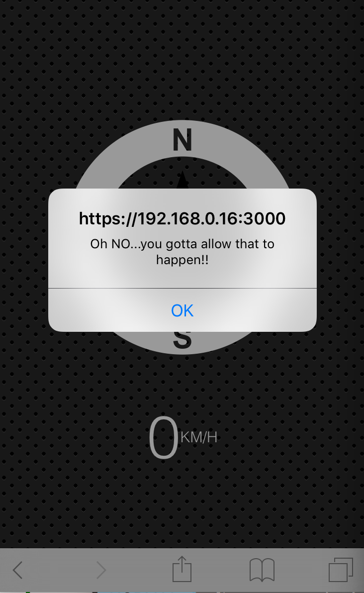

> This is a JavaScript practice with [JavaScript30](https://javascript30.com/) by [Wes Bos](https://github.com/wesbos) without any frameworks, no compilers, no boilerplate, and no libraries.

# 21 - Geolocation based Speedometer and Compass


### Basic Geolocation

The [`Geolocation.watchPosition()`](https://developer.mozilla.org/en-US/docs/Web/API/Geolocation/watchPosition) method is used to register a handler function that will be called automatically each time the position of the device changes. You can also, optionally, specify an error handling callback function.

```
const arrow = document.querySelector('.arrow');
const speed = document.querySelector('.speed-value');

navigator.geolocation.watchPosition(function(data) {
  // success callback
  // console.log(data);
  speed.textContent = data.coords.speed;
  arrow.style.transform = `rotate(${data.coords.heading}deg)`;
  // error callback
}, function(err) {
  console.log(err);
  alert('Oh NO...you gotta allow that to happen!!');
});
```

##### success

```
function(data) {
  speed.textContent = data.coords.speed;
  arrow.style.transform = `rotate(${data.coords.heading}deg)`;
}
```

##### error

```
function(err) {
  console.log(err);
  alert('Oh NO...you gotta allow that to happen!!');
}
```



